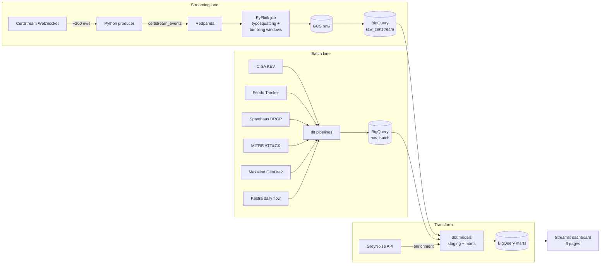

# Phishing Radar

Detecta infraestructura de phishing en tiempo real a partir del firehose de Certificate Transparency, enriquecida con datos de amenazas batch.

Data Engineering Zoomcamp 2026 capstone.

## La historia

Cada vez que un atacante monta un sitio de phishing necesita un certificado TLS (si no, Chrome lo bloquea). Esos certificados se publican en los logs de Certificate Transparency (CT) casi en tiempo real. Si observas el firehose, ves la infraestructura maliciosa mientras la están desplegando, antes de que llegue a los buzones de las víctimas.

Este proyecto ingiere ese firehose (via [CertStream](https://certstream.calidog.io/)), detecta typosquatting contra marcas populares, y correla contra feeds batch de amenazas (C2 de botnets, CVEs explotados, rangos IP hijacked, ATT&CK) para enriquecer cada detección con contexto operativo.

## Arquitectura



## Stack

| Capa | Herramienta |
|---|---|
| Streaming broker | Redpanda (Kafka-compatible) |
| Stream processing | PyFlink |
| Batch ingestion | dlt |
| Orchestration | Kestra |
| Data warehouse | BigQuery (particionado por día, clusterizado) |
| Transformations | dbt |
| Dashboard | Streamlit |
| IaC | Terraform |
| CI/CD | GitHub Actions |
| Package manager | uv |
| Linting | ruff |

## Fuentes de datos

| Fuente | Tipo | Cadencia | Auth |
|---|---|---|---|
| CertStream | WebSocket | ~200 ev/s | Sin auth |
| CISA KEV | JSON batch | Diario | Sin auth |
| Feodo Tracker | JSON batch | Cada minutos | Sin auth |
| Spamhaus DROP | TXT batch | Diario | Sin auth |
| MITRE ATT&CK STIX | JSON batch | Mensual | Sin auth |
| MaxMind GeoLite2 | MMDB batch | Mensual | Registro gratis |
| GreyNoise Community | REST (enrichment) | On-demand | Sin auth |

## Arrancar local

```bash
# Requisitos: Python 3.11+, Docker, uv (https://docs.astral.sh/uv/)
make setup           # instalar deps
make up              # arrancar Redpanda + Kestra
make producer &      # background CertStream producer
make flink           # consumer Flink
make batch           # ingestas batch
make dbt-run         # transformaciones
make dashboard       # lanza Streamlit en localhost:8501
```

Consolas locales:
- Redpanda Console: http://localhost:8080
- Kestra UI: http://localhost:8081
- Streamlit: http://localhost:8501

## Cloud (GCP)

```bash
cd terraform
terraform init
cp terraform.tfvars.example terraform.tfvars  # edita con tu project
terraform apply
```

## Reproducibilidad

El proyecto está pensado para clonar y arrancar con `make up` sin más intervención. Las credenciales se pasan via variables de entorno o service account keys; hay `.env.example` con todos los valores requeridos.

## Licencia

MIT.
