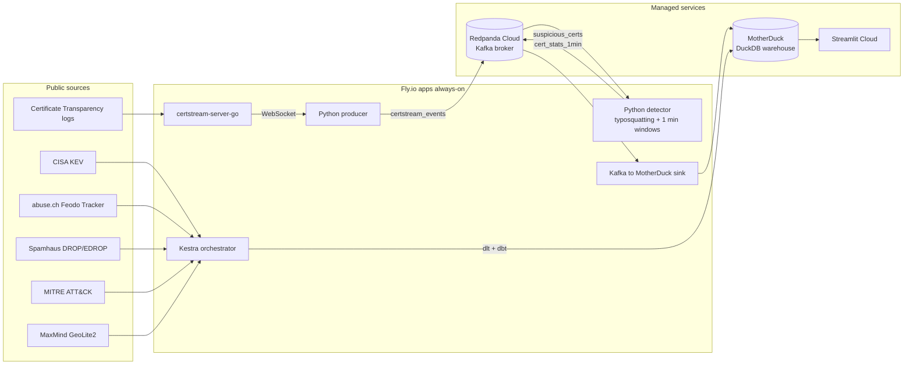

# Phishing Radar

Real-time phishing infrastructure detector. Watches the Certificate Transparency firehose, flags impersonation attempts as they happen, and correlates with active malware intelligence to give each detection operational context.

Capstone for the DataTalksClub [Data Engineering Zoomcamp 2026](https://github.com/DataTalksClub/data-engineering-zoomcamp).

## The story

Every phishing site needs a TLS certificate. Modern browsers mark non-HTTPS sites as unsafe, so attackers routinely request a certificate for their lookalike domain from Let's Encrypt or any other public CA. Those certificates are published to Certificate Transparency logs within seconds of issuance.

If you tail that firehose, you see the scam infrastructure while it is being built, before the first phishing email lands in anyone's inbox. Phishing Radar tails it for you.

**Two questions this project answers:**

1. Which brands are being impersonated right now?
2. Of all the suspicious certificates appearing in the feed, which ones are hosted on infrastructure we already know is bad (active botnet C2, hijacked IP space, vendors with unpatched CVEs being exploited)?

## Architecture



## Stack

| Layer | Tool | Where it runs |
|---|---|---|
| Stream broker | Redpanda Cloud (serverless) | AWS eu-central-1 |
| Stream processing | Python (Kafka consumer + producer with 1-min tumbling windows) | Fly.io |
| PyFlink reference job | `apache-flink` Table API | shipped in `streaming/flink/phishing_detector.py`; Python detector is the working twin |
| Batch ingestion | `dlt` | Fly.io (Kestra tasks) |
| Orchestration | Kestra | Fly.io |
| Warehouse | MotherDuck (DuckDB SaaS) | AWS eu-central-1 |
| Transformations | dbt (`dbt-duckdb`) | Fly.io (Kestra tasks) |
| Dashboard | Streamlit | Streamlit Cloud |
| IaC / deploys | `fly.toml` + GitHub Actions | n/a |
| Language | Python 3.11 (+ `uv`, `ruff`) | n/a |

## Data sources

| Source | Type | Cadence | Auth |
|---|---|---|---|
| Certificate Transparency logs (via [certstream-server-go](https://github.com/d-Rickyy-b/certstream-server-go)) | WebSocket | ~200 certs/s | None |
| CISA KEV catalogue | JSON dump | daily | None |
| abuse.ch Feodo Tracker | JSON dump | minutes | None |
| abuse.ch ThreatFox | JSON export | minutes | None |
| Spamhaus DROP / EDROP | TXT | daily | None |
| MITRE ATT&CK (Enterprise) | STIX 2 JSON | monthly | None |
| MaxMind GeoLite2 (CSV) | CSV zip | weekly | Free registration |

## Cloud footprint

| Service | Tier | Role |
|---|---|---|
| Fly.io | 5 machines (4x shared-cpu-1x@256MB + 1x@768MB for Kestra) | Always-on producer, detector, sink, CT stream aggregator, Kestra |
| Redpanda Cloud | Serverless free cluster | Kafka broker + 3 topics |
| MotherDuck | Free tier (10 GB) | Warehouse |
| Streamlit Cloud | Free tier | Dashboard hosting |

Expected monthly cost: around 10 EUR (Kestra VM) plus 4 x ~2 EUR for the small always-on machines. Everything else is on free tiers.

## Data warehouse notes (for reviewers)

> [!NOTE]
> The course rubric asks for "tables partitioned and clustered in a way that
> makes sense for the upstream queries (with explanation)". MotherDuck (DuckDB)
> doesn't expose BigQuery-style `PARTITION BY` / `CLUSTER BY` clauses, so this
> section explains the equivalent story.

- **Storage format.** DuckDB persists tables as columnar blocks with zone maps
  and dictionary encoding per column. That's the native "clustering":
  predicate pushdown uses min/max stats at the block level, so filters on
  `seen_at_ts`, `country`, `malware_family`, `vendor`, `issuer_cn`, `date_added`
  (the columns the dashboard actually filters by) skip blocks the same way a
  BigQuery clustered table skips micropartitions.
- **Size matters.** The marts are tiny. `mart_dashboard_kpis` is one row,
  `mart_dashboard_c2_by_country` is 22 rows, `mart_dashboard_kev_vendors` is
  20 rows, etc. Partitioning a 20-row table buys nothing. The biggest table is
  `geoip_city_blocks` at ~3.7M rows, which is already range-partitioned
  implicitly by CIDR (the IP-range join in `stg_geoip_city` uses a `between`
  filter against the `start_int`/`end_int` columns; DuckDB's zone maps make
  this linear scan effectively a range scan).
- **Materialisation strategy.** Every dashboard query reads from
  `table`-materialised marts (persisted) rather than views, so the reads don't
  recompute on every page refresh. See `dbt/models/marts/mart_dashboard_*.sql`
  for the pre-aggregated layer.
- **What we'd do at 100x scale.** If the `raw_suspicious_certs` table grew to
  hundreds of millions of rows, we would partition the raw landing table by
  `date(received_at)` (DuckDB supports this via multi-file storage / Hive
  partitioning for Parquet), and cluster the per-brand mart by `(brand, day)`.
  At our current working set (~4k suspicious certs/day) the marts fit in a few
  KB and any partitioning would be ceremony.

## Running it locally

Requirements: Python 3.11+, Docker, [`uv`](https://docs.astral.sh/uv/), [`just`](https://github.com/casey/just).

```bash
cp .env.example .env        # fill in your MOTHERDUCK_TOKEN (plus Redpanda creds if you have them)
just setup                   # install Python deps with uv
just up                      # docker-compose starts Redpanda + certstream-server-go locally
just producer &              # CertStream -> Kafka producer
just detect &                # typosquatting detector
just sink &                  # Kafka -> MotherDuck
just batch                   # one-shot ingestion of CISA KEV, Feodo, Spamhaus, MITRE, MaxMind
just dbt-run                 # transformations
just dashboard               # Streamlit at localhost:8501
```

Local consoles:

- Redpanda console: http://localhost:8082
- CertStream server: http://localhost:8090
- Streamlit dashboard: http://localhost:8501

## Deploy to cloud

```bash
flyctl apps create phishing-radar-certstream
flyctl apps create phishing-radar-producer
flyctl apps create phishing-radar-detector
flyctl apps create phishing-radar-sink
flyctl apps create phishing-radar-kestra

# Secrets (replace values)
flyctl secrets set --app phishing-radar-producer KAFKA_BOOTSTRAP=... KAFKA_SASL_MECHANISM=SCRAM-SHA-256 KAFKA_SASL_USERNAME=... KAFKA_SASL_PASSWORD=...
flyctl secrets set --app phishing-radar-detector KAFKA_BOOTSTRAP=... KAFKA_SASL_MECHANISM=SCRAM-SHA-256 KAFKA_SASL_USERNAME=... KAFKA_SASL_PASSWORD=...
flyctl secrets set --app phishing-radar-sink     KAFKA_BOOTSTRAP=... KAFKA_SASL_MECHANISM=SCRAM-SHA-256 KAFKA_SASL_USERNAME=... KAFKA_SASL_PASSWORD=... MOTHERDUCK_TOKEN=...
flyctl secrets set --app phishing-radar-kestra   KAFKA_BOOTSTRAP=... KAFKA_SASL_MECHANISM=SCRAM-SHA-256 KAFKA_SASL_USERNAME=... KAFKA_SASL_PASSWORD=... MOTHERDUCK_TOKEN=... MAXMIND_LICENSE_KEY=...

# Deploy
flyctl deploy --config deploy/certstream/fly.toml --app phishing-radar-certstream --ha=false
flyctl deploy --config deploy/producer/fly.toml   --app phishing-radar-producer   --dockerfile Dockerfile --ha=false
flyctl deploy --config deploy/detector/fly.toml   --app phishing-radar-detector   --dockerfile Dockerfile --ha=false
flyctl deploy --config deploy/sink/fly.toml       --app phishing-radar-sink       --dockerfile Dockerfile --ha=false
flyctl volumes create kestra_data --region cdg --size 1 --app phishing-radar-kestra
flyctl deploy --config deploy/kestra/fly.toml     --app phishing-radar-kestra     --ha=false
```

The `.github/workflows/deploy.yml` GitHub Action redeploys the three Python services on every push to `main`.

## Dashboard

Hosted: **<https://phishing-radar.streamlit.app>** (after you connect Streamlit Cloud to the GitHub repo and set the `MOTHERDUCK_TOKEN` secret).

Single page with a global filter bar (date range, brand, issuing CA, live refresh toggle) and five tabs:

1. **Overview**: top impersonated brands in the selected window, active C2s by malware family (hover a bar for a one-line context tooltip).
2. **Live phishing stream**: hourly volume of flagged certs with the current partial hour flagged, top issuing CAs, latest 50 certificates. Toggling "Live refresh" wraps the tab body in a `st.fragment(run_every="30s")` so it re-queries MotherDuck every half minute without touching the rest of the page.
3. **Threat landscape**: KEV monthly additions (current month rendered translucent so it isn't compared against complete months), Spamhaus DROP/EDROP buckets, KEV vendors with a ransomware-ratio colour scale, active C2s by hosting country.
4. **Map**: a `scatter_geo` world map with one dot per country where we see a C2. Dot size is active C2 count, colour is the count gradient, tooltip includes the dominant malware family and a one-liner description.
5. **Stack**: pipeline, batch and data-source reference panels.

Every widget reads from pre-aggregated marts (`mart_dashboard_kpis`, `mart_dashboard_suspicious_hourly`, `mart_dashboard_top_issuers`, `mart_dashboard_kev_vendors`, `mart_dashboard_kev_monthly`, `mart_dashboard_c2_by_country`) so the page stays fast even as the raw tables grow.

## Repository layout

```
.
├── batch/                    # dlt pipelines (one module per source)
├── dashboard/                # Streamlit app
├── dbt/                      # dbt project (duckdb adapter, MotherDuck target)
├── deploy/                   # fly.toml per Fly app
├── kestra/flows/             # Kestra flow definitions (YAML)
├── streaming/
│   ├── producer/             # CertStream -> Kafka
│   ├── flink/                # detection logic + PyFlink reference job + Python twin
│   └── sink/                 # Kafka -> MotherDuck
├── tests/                    # pytest suite
├── Dockerfile                # single image for all Python services
├── docker-compose.yml        # Redpanda + certstream-server-go + Kestra for local dev
├── justfile                  # cross-OS task runner
├── pyproject.toml
└── README.md
```

## Tests and quality

- `pytest` covers the typosquatting detector (19 assertions: homoglyph, Cyrillic look-alikes, Damerau-Levenshtein including transpositions, Jaro-Winkler prefix cases, legitimate domains, edge cases).
- `ruff check` in CI.
- `dbt test` runs 13 schema tests plus 1 singular test (IP format sanity).
- Detector design note: `docs/detection_alternatives.md` explains why we moved from Levenshtein to Damerau-Levenshtein + Jaro-Winkler and why MinHash was considered then dropped for this workload.
- CI workflow at `.github/workflows/ci.yml`.

## License

MIT.
