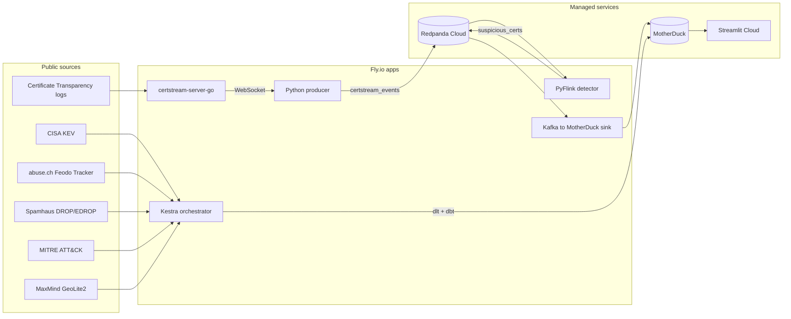

# Phishing Radar

Real-time phishing infrastructure detection from Certificate Transparency logs. Flags domain impersonation as certificates are issued and cross-references detections against active malware intelligence (CISA KEV, abuse.ch, Spamhaus, MITRE ATT&CK).

[](LICENSE)
[](https://www.python.org/downloads/)
[](#archive-mode)

**Data capture window:** 2026-04-23 to 2026-05-05. The project ran as a live cloud deployment for 12 days and is now preserved as a frozen, zero-dependency archive. The dashboard is fully explorable with no API keys, no Docker, and no cloud accounts.

## Quick start

```bash
git clone https://github.com/pavel-kalmykov/phishing-radar.git
cd phishing-radar
uv sync
ARCHIVE_MODE=1 streamlit run dashboard/app.py
```

Opens at `http://localhost:8501`. All six tabs work: Overview, Live phishing stream, Threat landscape, Map, Health, Stack. The archive banner indicates the data is frozen; date pickers are locked to the capture range.

## Why this exists

Every phishing site needs a TLS certificate. Browsers flag non-HTTPS sites as unsafe, so attackers request certificates for lookalike domains from Let's Encrypt and other public CAs. Those certificates appear in Certificate Transparency logs within seconds of issuance.

If you tail that firehose, you see scam infrastructure while it is being built, before the first phishing email lands. Phishing Radar tails it and answers two questions:

1. Which brands are being impersonated right now?
2. Of the suspicious certificates, which ones are hosted on infrastructure already known to be hostile (active botnet C2s, hijacked IP space, vendors with exploited CVEs)?

## Dashboard

Six tabs, all reading from pre-aggregated dbt marts in a 97 MB DuckDB snapshot:

| Tab | What it shows |
|---|---|
| **Overview** | Top impersonated brands, active C2s by malware family (hover for context), detection volume trend |
| **Live phishing stream** | Hourly flagged cert volume, top issuing CAs, latest 50 detections with similarity scores |
| **Threat landscape** | CISA KEV monthly additions, Spamhaus DROP/EDROP breakdown, KEV vendors ranked by ransomware ratio, C2s by country |
| **Map** | Scatter geo-plot with one marker per country hosting C2 infrastructure, sized by active count, with malware family tooltips |
| **Health** | End-to-end pipeline loss monitor (WebSocket to detector hop), heartbeat staleness, per-worker throughput |
| **Stack** | Architecture reference panels for streaming pipeline, batch ingestion, and data sources |

## Architecture (original cloud deployment)



The pipeline processed ~200 certificates per second through a PyFlink detector with 1-minute tumbling windows, applying Damerau-Levenshtein and Jaro-Winkler similarity to catch typosquatting and homoglyph attacks against a configured brand list. Detections landed in MotherDuck via a Kafka sink with idempotency guarantees, then 12 dbt marts pre-aggregated the data for the dashboard.

## Archive mode

The cloud deployment ended on 2026-05-05 when managed services (Redpanda Cloud, MotherDuck) expired. The archive preserves every dashboard mart and 134,000 recent detections in a single 97 MB DuckDB file committed to this repository. Set `ARCHIVE_MODE=1` and the dashboard reads it directly with zero external dependencies.

## Stack

| Layer | Tool | Notes |
|---|---|---|
| Stream broker | Redpanda (Kafka API) | Cloud during capture; local via Docker for full replay |
| Stream processing | PyFlink DataStream | 1-min tumbling windows, typosquatting + homoglyph detection |
| Batch ingestion | dlt | CISA KEV, Feodo, ThreatFox, Spamhaus, MITRE, MaxMind |
| Orchestration | Kestra | Scheduled batch flows |
| Warehouse | DuckDB | 17 GB during live runs; 97 MB archive snapshot |
| Transformations | dbt (dbt-duckdb) | 12 pre-aggregated marts |
| Dashboard | Streamlit | Archive mode ($0) or local |

## Data sources

| Source | Type | Cadence |
|---|---|---|
| Certificate Transparency logs (via certstream-server-go) | WebSocket | ~200 certs/s |
| CISA KEV catalogue | JSON | Daily |
| abuse.ch Feodo Tracker | JSON | Minutes |
| abuse.ch ThreatFox | JSON | Minutes |
| Spamhaus DROP / EDROP | TXT | Daily |
| MITRE ATT&CK (Enterprise) | STIX 2 JSON | Monthly |
| MaxMind GeoLite2 | CSV | Weekly |

## Running fully local (with live pipeline)

If you want to run the full pipeline with a live CertStream feed, you need Docker, Python 3.11+, `uv`, and `just`:

```bash
cp .env.example .env            # no cloud tokens needed
just setup                       # Python deps
just up-local                    # docker-compose: Redpanda + certstream + Kestra

export DATABASE_URL=data/local.duckdb

just producer &                  # CertStream to local Redpanda
just detect &                    # PyFlink detector (needs JDK 17)
just sink &                      # Kafka to local DuckDB
just monitor &                   # Observability
just batch                       # one-shot batch ingestion
just dbt-run-local               # dbt transforms
just dashboard                   # Streamlit at localhost:8501
```

The full setup writes to `data/local.duckdb` (expect it to grow to tens of GB over days). The archive snapshot was extracted from the same pipeline after the 12-day capture window.

## Repository layout

```
.
├── batch/                    # dlt pipelines (one module per source)
├── dashboard/                # Streamlit app
├── data/                     # archive.duckdb (97 MB, committed)
├── dbt/                      # dbt project (models, tests, macros)
├── deploy/                   # fly.toml per Fly app (historical)
├── kestra/flows/             # Kestra flow definitions (YAML)
├── streaming/
│   ├── producer/             # CertStream to Kafka
│   ├── flink/                # PyFlink detection job
│   ├── sink/                 # Kafka to DuckDB with idempotency
│   └── observability/        # Pipeline health monitor
├── tests/                    # pytest suite
├── Dockerfile                # single image for all Python services
├── docker-compose.yml        # Redpanda + certstream + Kestra
├── justfile                  # cross-OS task runner
├── pyproject.toml
└── README.md
```

## Tests and quality

- **pytest**: 26 assertions covering the typosquatting detector and every batch ingester parser (retry/backoff, mocked HTTP responses).
- **dbt**: 13 schema tests + 3 singular tests (IP format sanity, pipeline health invariants, base models not empty).
- **ruff**: linting in CI.
- **Detector design**: `docs/detection_alternatives.md` documents the migration from Levenshtein to Damerau-Levenshtein + Jaro-Winkler, and why MinHash was dropped.
- **Memory profiling**: `docs/memory_profile.md` records RSS peaks per service and right-sizing decisions.

## Known limitations

These are intentional trade-offs:

- **At-least-once, not exactly-once.** The sink commits Kafka offsets after a DuckDB flush. If killed between flush and commit, the next run replays and dedup happens at the mart layer. Fine for analytics; not safe for billing.
- **Detection latency floor.** 1-minute tumbling windows keep state bounded. A cert appears in the dashboard 60-120 seconds after issuance. Near real-time, not sub-second.
- **CT firehose gaps.** If the producer disconnects from the WebSocket, events during the gap are not replayed. Reconnect logic exists; replay does not.
- **Single-instance services.** Each Fly app ran one machine. No HA, no leader election. Recovery depended on Fly's restart policy.
- **Brand allowlist scope.** The detector only flags impersonation against configured brands (`STREAMING_BRAND_LIST_PATH`). Anything outside the list is invisible by design.
- **GeoLite2 accuracy.** Free tier, not commercial-grade. Some IPs resolve only to country level. The map jitters co-located markers to be honest about resolution.

## License

MIT.
